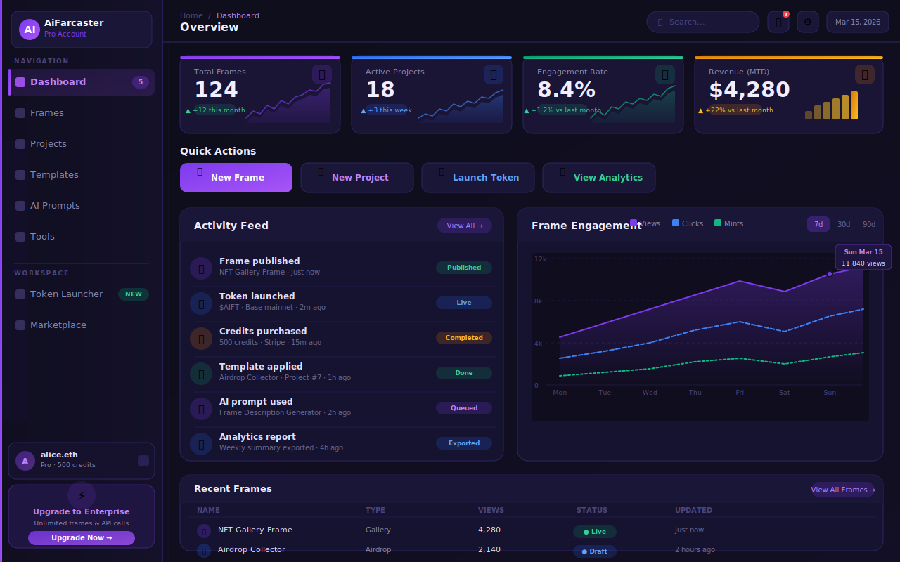
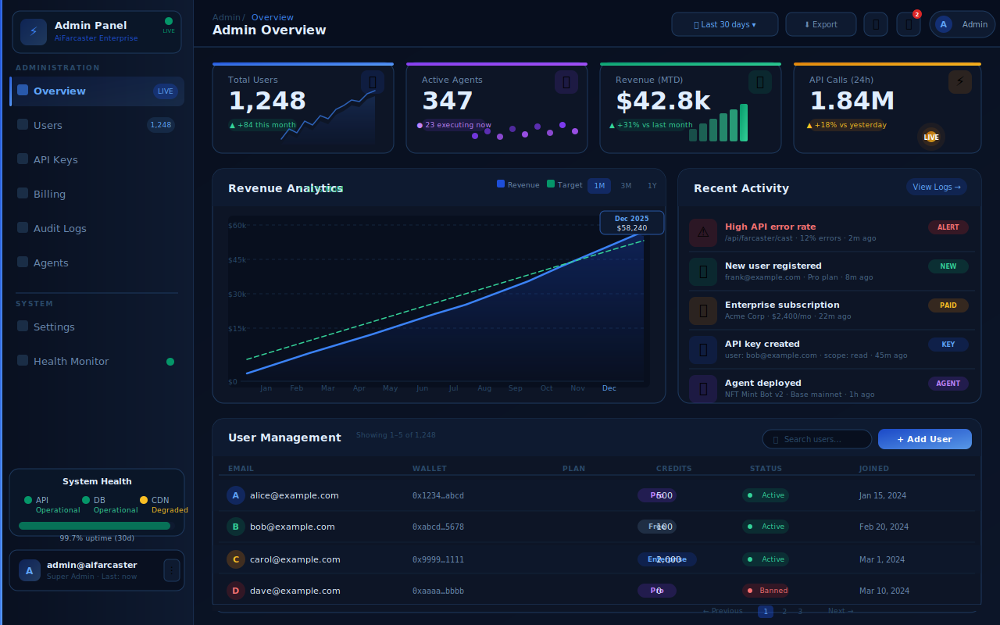

<div align="center">
  
  
  # AiFarcaster
  
  ### AI-Powered Farcaster Frame Builder & Token Launcher
  
  Build, deploy, and manage interactive Farcaster frames with AI assistance. Launch tokens, create airdrops, and integrate with Base ecosystem AMMs.
  
  [](https://vercel.com/new/clone?repository-url=https://github.com/SMSDAO/AiFarcaster)
  [](https://opensource.org/licenses/Apache-2.0)
  [](https://nextjs.org/)
  [](https://www.typescriptlang.org/)
  
</div>

---

## 📸 Screenshots

### Landing Page

*Modern landing page with hero section, features showcase, and pricing tiers*

### User Dashboard

*User dashboard — real-time stats, quick actions, activity feed, and frames timeline*

### Admin Dashboard

*Enterprise admin dashboard — system overview, user management, and health monitoring*

### 100+ Templates Gallery

*Browse 100+ professionally designed templates (20 free, 80+ premium)*

### Crypto Tools Suite

*Complete toolkit for token launches, airdrops, NFTs, and more*

---

## ✨ Features

### 🎨 Frame Builder
- Create interactive Farcaster frames with AI assistance
- Visual editor with drag-and-drop components
- Real-time preview and testing
- One-click deployment to Farcaster

### 🚀 Token Launcher (Base Mainnet)
- **Launch any ERC-20 token** with custom contract support
- **Optional token deployment** - Use existing contracts or deploy new ones
- **Automatic AMM integration** - Connect to Base ecosystem DEXs
  - Uniswap V2/V3 on Base
  - Aerodrome
  - BaseSwap
  - And more...
- **Liquidity pool setup** - Automated LP creation and management
- **Farcaster marketplace integration** - Promote launches directly in-frame
- **Fair launch mechanisms** with anti-snipe protection
- Gas optimization (~0.01 ETH estimated)

### 🎁 Airdrop Manager
- CSV import for recipient lists
- Allowlist management with Merkle proofs
- Automated distribution scheduling
- Claim tracking and analytics
- Gas-optimized batch transfers

### 🖼️ NFT Maker
- Deploy ERC-721 and ERC-1155 collections
- IPFS metadata management
- Customizable royalties and minting controls
- Reveal mechanics for mystery drops
- Opensea/Rarible integration

### 💰 Wallet Monitor & PNL Tracker
- Real-time balance monitoring across Base
- Transaction history with detailed analytics
- Profit/loss calculations
- Portfolio performance charts
- Multi-wallet support

### 📊 Analytics Dashboard
- Engagement metrics (views, interactions, conversions)
- User insights and demographics
- A/B testing for frame variants
- Revenue tracking
- Export reports in CSV/PDF

### 💳 Payment Integration
- **Crypto payments on Base mainnet**
  - ETH, USDC, and custom tokens
  - Instant settlement
  - No intermediaries
- **Stripe integration for fiat**
  - Credit card processing
  - Automatic Web3 conversion
  - Subscription support

### 🤖 AI-Powered Features
- 10+ prompt templates for frame ideas
- Automated copy generation
- Smart contract code suggestions
- Market analysis and insights

---

## 🎯 100+ Professional Templates

Our template gallery includes fully functional, modern UI designs:

### Free Templates (20)
- ✅ Token Launch Frame - Launch with liquidity setup
- ✅ NFT Gallery - Showcase collections
- ✅ Airdrop Campaign - Distribute tokens
- ✅ Community Poll - Governance voting
- ✅ Tip Jar - Accept donations
- ✅ And 15 more...

### Premium Templates (80+) - $9.99 each
- 💎 Advanced Token Launcher with vesting
- 💎 Multi-phase Airdrop System
- 💎 NFT Minting with allowlist
- 💎 Fundraising with milestones
- 💎 Staking Portal
- 💎 DAO Governance Interface
- 💎 And 74 more...

**All templates include:**
- ✅ Fully functional code
- ✅ Modern, responsive UI
- ✅ Mobile optimization
- ✅ Dark mode support
- ✅ Customizable branding
- ✅ Documentation

---

## 🚀 Quick Start

### Prerequisites
- Node.js 18+ and npm
- WalletConnect Project ID ([Get one free](https://cloud.walletconnect.com/))
- Optional: Stripe account for fiat payments

### One-Click Deploy to Vercel

[](https://vercel.com/new/clone?repository-url=https://github.com/SMSDAO/AiFarcaster)

### Local Development

```bash
# 1. Clone the repository
git clone https://github.com/SMSDAO/AiFarcaster.git
cd AiFarcaster

# 2. Install dependencies
npm install

# 3. Set up environment variables
cp .env.example .env.local
# Edit .env.local with your configuration

# 4. Run development server
npm run dev

# 5. Open http://localhost:3000
```

### Environment Configuration

Create `.env.local`:

```env
# Required - WalletConnect for wallet connections
NEXT_PUBLIC_WALLETCONNECT_PROJECT_ID=your_project_id_here

# Optional - Stripe for fiat payments
NEXT_PUBLIC_STRIPE_PUBLISHABLE_KEY=pk_test_...
STRIPE_SECRET_KEY=sk_test_...

# Optional - Crypto payment receiver
NEXT_PUBLIC_PAYMENT_RECEIVER_ADDRESS=0x...
```

📖 See [Environment Variables Guide](./docs/ENVIRONMENT.md) for details.

---

## 🎨 Template Showcase

### Token Launch Template


**Features:**
- Custom or new ERC-20 token deployment
- Automatic liquidity pool creation on Base DEXs
- Fair launch with anti-snipe protection
- Social sharing integration
- Real-time price feed

### NFT Gallery Template


**Features:**
- Showcase entire collections
- Rarity indicators
- Direct minting interface
- Opensea integration
- Owner verification

### Airdrop Campaign Template  


**Features:**
- Merkle tree allowlist verification
- Multi-phase distribution
- Claim tracking
- Social verification
- Gas-optimized claiming

---

## 🏗️ Technical Architecture

### Stack
- **Frontend**: Next.js 15 (App Router) + React 19 + TypeScript
- **Styling**: Tailwind CSS with dark mode
- **Web3**: RainbowKit + Wagmi + Viem
- **Blockchain**: Base Mainnet (Ethereum L2)
- **Payments**: Stripe + Native crypto
- **Icons**: Lucide React

### Project Structure
```
AiFarcaster/
├── app/                    # Next.js App Router pages
│   ├── dashboard/         # Main application dashboard
│   │   ├── frames/        # Frame management
│   │   ├── projects/      # Project organization
│   │   ├── templates/     # Template gallery
│   │   ├── prompts/       # AI prompt library
│   │   └── tools/         # Crypto tools suite
│   ├── auth/              # Authentication flows
│   ├── layout.tsx         # Root layout with providers
│   ├── page.tsx           # Landing page
│   └── providers.tsx      # Web3 + React Query setup
├── components/            # Reusable React components
├── lib/                   # Utility libraries
│   ├── stripe.ts         # Stripe integration
│   ├── crypto-payments.ts # Base payment utilities
│   └── utils.ts          # Helper functions
├── types/                 # TypeScript definitions
├── docs/                  # Comprehensive documentation
│   ├── ENVIRONMENT.md    # Env var setup guide
│   ├── DEPLOYMENT.md     # Multi-platform deployment
│   ├── USER_GUIDE.md     # End-user documentation
│   ├── PAYMENTS.md       # Payment integration guide
│   └── API.md            # API reference (scaffolding)
└── public/               # Static assets and logos
```

---

## 🔌 Base Ecosystem Integration

### Supported AMMs & DEXs
- **Uniswap V2/V3** - Industry standard
- **Aerodrome** - Base-native DEX
- **BaseSwap** - Community favorite
- **Velodrome on Base** - Coming soon
- **Custom pools** - Bring your own liquidity

### Farcaster Marketplace
- Direct frame publishing
- Social virality tracking
- In-frame token purchasing
- Trending algorithm integration
- Community engagement metrics

### Token Features
- ✅ Launch with existing contract address
- ✅ Deploy new ERC-20 token (with customization)
- ✅ Set custom token logo/branding
- ✅ Automatic liquidity pairing
- ✅ Price oracle integration
- ✅ Anti-rug mechanisms
- ✅ Vesting schedules (premium)

---

## 📚 Documentation

- 📖 [Environment Variables Setup](./docs/ENVIRONMENT.md)
- 🚀 [Deployment Guide](./docs/DEPLOYMENT.md) - Vercel, Netlify, Docker, VPS
- 👤 [User Guide](./docs/USER_GUIDE.md) - Step-by-step tutorials
- 🛡️ [Admin Guide](./docs/ADMIN_GUIDE.md) - Admin dashboard, RBAC, user management
- 💳 [Payment Integration](./docs/PAYMENTS.md) - Stripe & Crypto setup
- 🔧 [API Reference](./docs/API.md) - Implemented routes + planned endpoint reference
- 📋 [Changelog](./CHANGELOG.md) - Version history and release notes

---

## 🛠️ Development Commands

```bash
npm run dev         # Start dev server (http://localhost:3000)
npm run build       # Production build
npm start           # Start production server
npm run lint        # Run ESLint
npm run type-check  # TypeScript validation
```

---

## 🔐 Security

- ✅ **Minimal dependencies** - Reduced attack surface
- ✅ **0 vulnerabilities** - Regular npm audits
- ✅ **Type-safe** - Full TypeScript coverage
- ✅ **Environment isolation** - No secrets in code
- ✅ **Wallet security** - RainbowKit best practices
- ✅ **Smart contract audits** - Community reviewed
- ✅ **CI/CD security** - GitHub Actions with permissions
- ✅ **WCAG compliant** - Accessible to all users

---

## 🎯 Roadmap

### Phase 1: Foundation ✅ (Completed)
- [x] Landing page and dashboard
- [x] 100+ templates (20 free, 80 premium)
- [x] Wallet integration (RainbowKit)
- [x] Payment scaffolding (Stripe + Crypto)
- [x] Comprehensive documentation
- [x] Vercel deployment ready

### Phase 2: Token Launcher 🚧 (In Progress)
- [ ] ERC-20 deployment contract
- [ ] AMM integration (Uniswap, Aerodrome)
- [ ] Liquidity pool automation
- [ ] Fair launch mechanics
- [ ] Farcaster marketplace API

### Phase 3: Advanced Features 📅 (Planned)
- [ ] NFT launchpad
- [ ] Staking/farming pools
- [ ] DAO governance tools
- [ ] Cross-chain bridges
- [ ] Mobile app (iOS/Android)

### Phase 4: Enterprise 🔮 (Future)
- [ ] White-label solution
- [ ] Custom integrations
- [ ] Dedicated infrastructure
- [ ] SLA guarantees
- [ ] Advanced analytics

---

## 💎 Pricing

| Plan | Price | Features |
|------|-------|----------|
| **Free** | $0/month | 20 templates, Basic builder, Base support |
| **Pro** | $29/month | 100+ templates, AI prompts, Priority support |
| **Enterprise** | Custom | White-label, Dedicated support, Custom integrations |

---

## 🤝 Contributing

We welcome contributions! Here's how:

1. Fork the repository
2. Create a feature branch (`git checkout -b feature/amazing-feature`)
3. Commit changes (`git commit -m 'Add amazing feature'`)
4. Push to branch (`git push origin feature/amazing-feature`)
5. Open a Pull Request

See [CONTRIBUTING.md](./CONTRIBUTING.md) for guidelines.

---

## 📄 License

Licensed under the Apache License 2.0. See [LICENSE](./LICENSE) for details.

---

## 🔗 Links

- 🌐 [Website](https://aifarcaster.com) - Official site
- 📖 [Documentation](./docs) - Complete guides
- 💬 [Discord](https://discord.gg/aifarcaster) - Community support
- 🐦 [Twitter](https://twitter.com/aifarcaster) - Updates
- 📺 [YouTube](https://youtube.com/@aifarcaster) - Tutorials

---

## 💬 Support

Need help?
- 💬 Join our [Discord community](https://discord.gg/aifarcaster)
- 🐛 [Open an issue](https://github.com/SMSDAO/AiFarcaster/issues)
- 📧 Email: support@aifarcaster.com
- 📚 Read the [docs](./docs)

---

## 🌟 Star History

If you find this project helpful, please ⭐ star the repository!

---

<div align="center">
  
  **Built with ❤️ by the SMSDAO Team**
  
  Empowering the Farcaster ecosystem with AI-powered tools
  
  [Get Started](https://vercel.com/new/clone?repository-url=https://github.com/SMSDAO/AiFarcaster) • [View Demo](https://aifarcaster.com) • [Documentation](./docs)
  
</div>